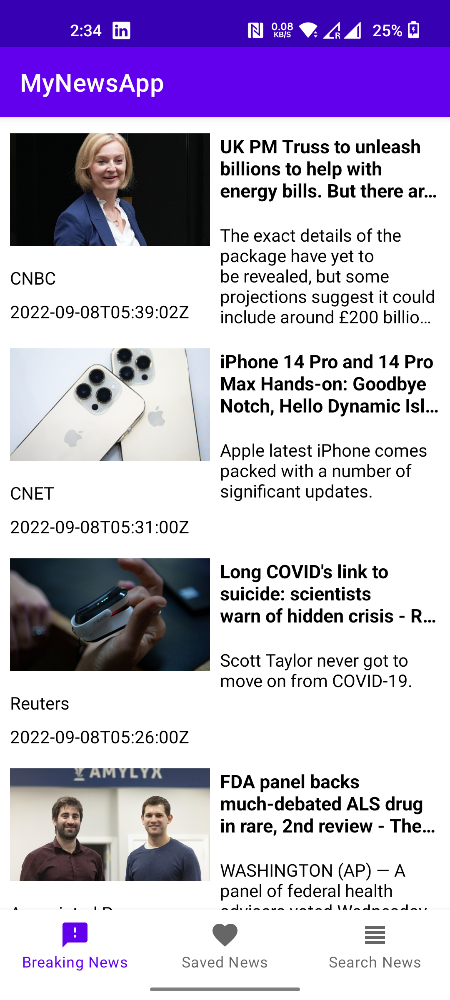
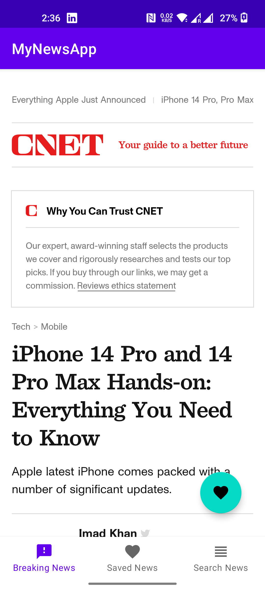
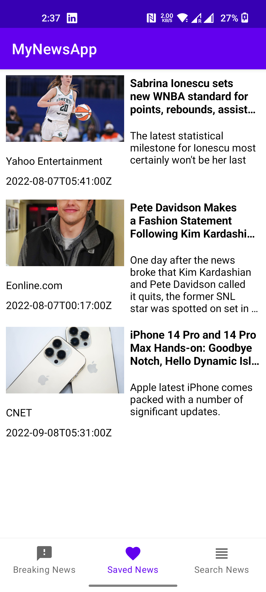
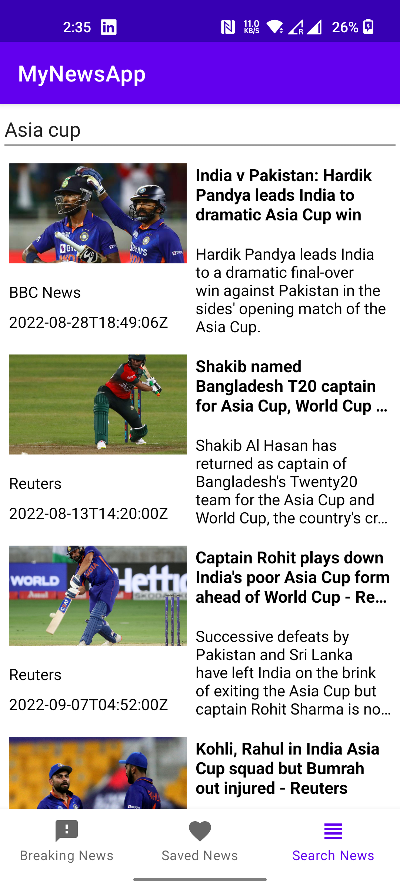

# MyNewsApp
This is a News App where you can read the news of your choice. You can save your favorites news item in your database also.

This App is designed with MVVM Architecture pattern that uses Fragments for UI, Dagger Hilt for Dependency Injection, Room Database for storage and news API to fetch news data.

